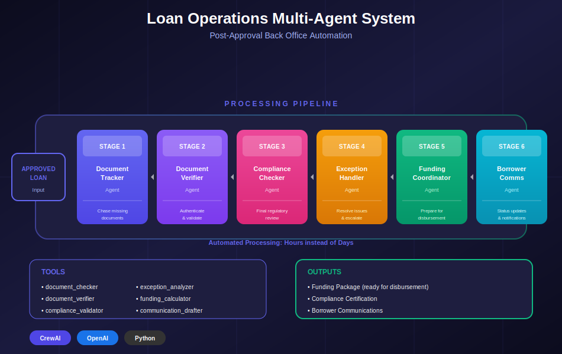

# 📋 AgenticLoanOperations

A production-ready **multi-agent AI system** for automated post-approval loan operations. Built with [CrewAI](https://crewai.com), this system handles the back office workflow from loan approval to funding — document collection, verification, compliance review, exception handling, and borrower communication.

## 🏗️ System Architecture

<div align="center">
  
</div>

## 🎯 Overview

This system automates the post-approval loan operations process using 6 specialized AI agents that work together sequentially, mimicking a real lending back office workflow:

```
┌─────────────────────────────────────────────────────────────────────────────┐
│                    LOAN OPERATIONS SYSTEM                                   │
│                  (Post-Approval → Funding)                                  │
├─────────────────────────────────────────────────────────────────────────────┤
│                                                                             │
│   📋 DOCUMENTS           ✓ VERIFICATION        ⚖ COMPLIANCE                │
│   ┌─────────────┐       ┌─────────────┐       ┌─────────────┐              │
│   │  Document   │──────▶│ Verification│──────▶│ Compliance  │              │
│   │   Tracker   │       │    Agent    │       │   Checker   │              │
│   └─────────────┘       └─────────────┘       └─────────────┘              │
│         │                                            │                      │
│         │                                            ▼                      │
│         │                                     ┌─────────────┐              │
│         │                                     │  Exception  │              │
│         │                                     │   Handler   │              │
│         │                                     └─────────────┘              │
│         │                                            │                      │
│         │                                            ▼                      │
│         │                                     ┌─────────────┐              │
│         │                                     │   Funding   │              │
│         │                                     │ Coordinator │              │
│         │                                     └─────────────┘              │
│         │                                            │                      │
│         ▼                                            ▼                      │
│   ┌─────────────────────────────────────────────────────────┐              │
│   │              COMMUNICATION AGENT                         │              │
│   │         (Borrower Updates & Notifications)               │              │
│   └─────────────────────────────────────────────────────────┘              │
│                              │                                              │
│                              ▼                                              │
│                    ┌─────────────────┐                                     │
│                    │  LOAN FUNDED    │                                     │
│                    │  ✓ Documents    │                                     │
│                    │  ✓ Verified     │                                     │
│                    │  ✓ Compliant    │                                     │
│                    │  ✓ Disbursed    │                                     │
│                    └─────────────────┘                                     │
│                                                                             │
└─────────────────────────────────────────────────────────────────────────────┘
```

## 🤖 Agent Roles

| Agent | Role | Tools |
|-------|------|-------|
| **Document Tracker** | Tracks required documents, identifies missing items, manages collection | `document_checker` |
| **Verification Agent** | Verifies document authenticity, completeness, and validity | `document_verifier` |
| **Compliance Checker** | Runs final compliance checks (AML, KYC, TILA, ECOA) | `compliance_validator` |
| **Exception Handler** | Analyzes issues, proposes resolutions, escalates critical items | `exception_analyzer` |
| **Funding Coordinator** | Calculates disbursement amounts, prepares funding package | `funding_calculator` |
| **Communication Agent** | Drafts borrower communications, status updates, funding notices | `communication_drafter` |

## 🚀 Quick Start

### Prerequisites
- Python 3.10+
- OpenAI API key (or Anthropic)

### Installation

```bash
# Clone the repository
git clone https://github.com/Dewale-A/AgenticLoanOperations.git
cd AgenticLoanOperations

# Create virtual environment
python -m venv venv
source venv/bin/activate  # On Windows: venv\Scripts\activate

# Install dependencies
pip install -r requirements.txt

# Configure environment
cp .env.example .env
# Edit .env and add your OPENAI_API_KEY
```

### Running the System

**CLI Mode:**
```bash
# List available loan files
python main.py --list

# Process a specific loan
python main.py --loan LOAN001.json

# Process all loans in sample_loans/
python main.py

# Quiet mode (less verbose output)
python main.py --loan LOAN001.json --quiet
```

**API Mode:**
```bash
# Start the FastAPI server
uvicorn src.api.main:app --host 0.0.0.0 --port 8000

# Or with Docker
docker-compose up -d
```

**API Docs:** http://localhost:8000/docs (Swagger UI)

## 📁 Project Structure

```
AgenticLoanOperations/
├── main.py                     # CLI entry point
├── requirements.txt            # Dependencies
├── Dockerfile                 # Container image
├── docker-compose.yml         # Container orchestration
├── .env.example               # Environment template
├── sample_loans/              # Sample loan files
│   ├── LOAN001.json           # Mortgage - document collection
│   ├── LOAN002.json           # Personal loan - verification
│   └── LOAN003.json           # Auto loan - with exceptions
├── output/                    # Generated reports
├── docs/
│   └── architecture.svg       # System architecture diagram
├── src/
│   ├── api/
│   │   └── main.py            # FastAPI application
│   ├── agents/
│   │   └── ops_agents.py      # Agent definitions
│   ├── tasks/
│   │   └── ops_tasks.py       # Task definitions
│   ├── tools/
│   │   └── ops_tools.py       # Tool implementations
│   ├── config/
│   │   └── settings.py        # Configuration
│   ├── models/
│   │   └── loan_file.py       # Data models
│   └── crew.py                # Crew orchestration
└── tests/
    └── test_api.py            # API tests
```

## 🌐 API Reference

Interactive docs at: `http://localhost:8000/docs`

| Method | Endpoint | Description |
|--------|----------|-------------|
| GET | `/api/v1/health` | Health check |
| GET | `/api/v1/loans` | List available loan files |
| GET | `/api/v1/loans/{loan_id}` | Get loan details |
| POST | `/api/v1/process` | Process loan (sync) |
| POST | `/api/v1/process/async` | Process loan (async) |
| GET | `/api/v1/jobs/{job_id}` | Check async job status |

**Example - Process a loan:**
```bash
curl -X POST http://localhost:8000/api/v1/process \
  -H "Content-Type: application/json" \
  -d '{"loan_id": "LOAN001"}'
```

**Example - Async processing:**
```bash
# Submit job
curl -X POST http://localhost:8000/api/v1/process/async \
  -H "Content-Type: application/json" \
  -d '{"loan_id": "LOAN001"}'

# Poll for status
curl http://localhost:8000/api/v1/jobs/{job_id}
```

## 📊 Sample Loan Files

The system includes 3 sample loans demonstrating different scenarios:

| Loan | Type | Status | Scenario |
|------|------|--------|----------|
| LOAN001 | Mortgage | Document Collection | Missing tax returns, title insurance, flood cert |
| LOAN002 | Personal | Verification | All docs received, ready for verification |
| LOAN003 | Auto | Exception Handling | Expired income docs, address verification failure |

## ⚙️ Configuration

Key settings in `.env`:

```bash
OPENAI_API_KEY=sk-...              # Required (or ANTHROPIC_API_KEY)
OPENAI_MODEL=gpt-4o-mini           # Model selection
DEFAULT_LLM_PROVIDER=openai        # openai or anthropic
SAMPLE_LOANS_DIR=./sample_loans    # Input directory
OUTPUT_DIR=./output                # Output directory
```

## 📋 Output Reports

Reports are generated in Markdown format and include:

- **Document Status** - Complete inventory of required vs. received documents
- **Verification Results** - Pass/fail status for each verified document
- **Compliance Review** - Results of all compliance checks
- **Exception Analysis** - Issues found with proposed resolutions
- **Funding Package** - Disbursement calculations and instructions
- **Borrower Communications** - Drafted emails/letters

## 🔗 Related Projects

This project is part of a loan lifecycle automation suite:

- **[AgenticLoanOrigination](https://github.com/Dewale-A/AgenticLoanOrigination)** - Application → Approval (upstream)
- **AgenticLoanOperations** - Approval → Funding (this project)

## 🐳 Docker Deployment

```bash
# Build and run
docker-compose up -d

# View logs
docker-compose logs -f

# Stop
docker-compose down
```

The API will be available at `http://localhost:8000`.

## 🧪 Testing

```bash
# Run tests
pytest tests/ -v

# Run with coverage
pytest tests/ --cov=src --cov-report=html
```

## 📈 Future Enhancements

- [ ] Integration with document management systems
- [ ] Real-time status dashboard
- [ ] Automated borrower portal notifications
- [ ] ML-based fraud detection
- [ ] Integration with core banking systems
- [ ] Parallel document verification for faster processing
- [ ] Redis job queue for production async processing
- [ ] PostgreSQL for job persistence

## 📜 License

MIT License - see [LICENSE](LICENSE) for details.

## 👤 Author

**Dewale A** - Data & AI Governance Professional
- GitHub: [@Dewale-A](https://github.com/Dewale-A)
- LinkedIn: [Connect](https://linkedin.com/in/dewale-a)

---

*Built as part of a portfolio demonstrating autonomous multi-agent systems for financial services.*
